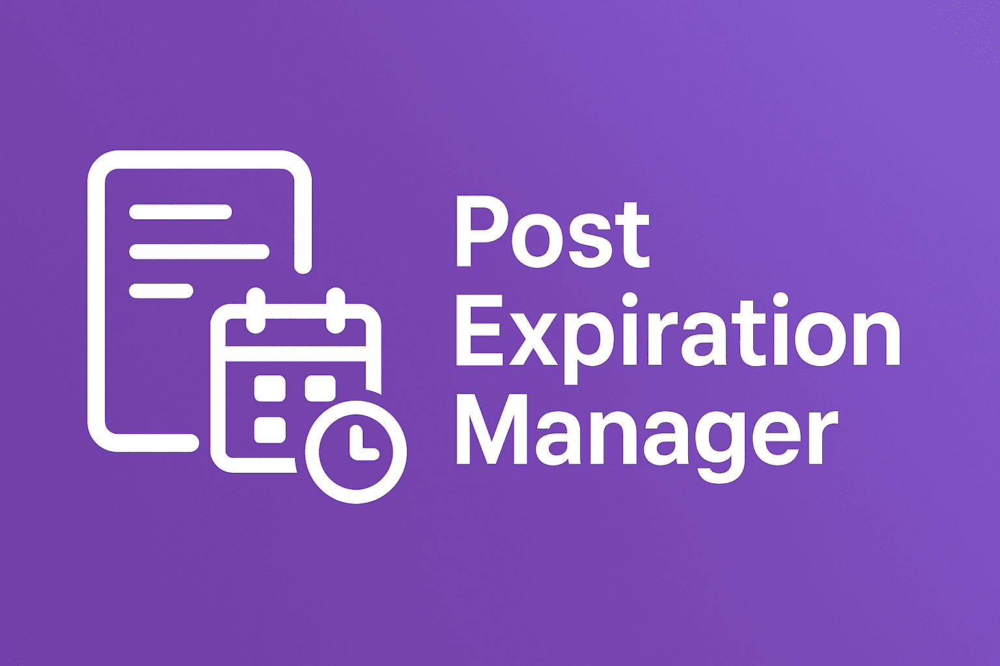

# Post Expiration Manager

A WordPress plugin to control post expiration. Automatically set posts to draft or delete them after a specified date and time.

## Description

This plugin adds a meta box to the post editor screen, allowing you to set an expiration date and an action (move to draft or delete) for each post. A scheduled cron job runs hourly to check for expired posts and performs the selected action.

## Installation

1.  Download the plugin files.
2.  Upload the `post-expiration-manager` directory to your `/wp-content/plugins/` directory.
3.  Activate the plugin through the 'Plugins' menu in WordPress.

## Usage

1.  On the post editor screen, find the "Post Expiration Settings" meta box.
2.  Set the "Expiration Date" using the date-time picker.
3.  Choose the "Action on Expiration" (Move to Draft or Delete).
4.  Save or update the post.

The plugin will automatically handle the rest.
